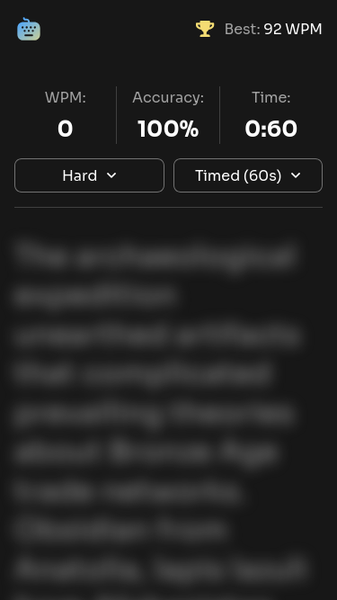

# Frontend Mentor - Typing Speed Test solution

This is a solution to the [Typing Speed Test challenge on Frontend Mentor](https://www.frontendmentor.io/challenges/typing-speed-test). Frontend Mentor challenges help you improve your coding skills by building realistic projects.

## Table of contents

- [Overview](#overview)
  - [The challenge](#the-challenge)
  - [Optional challenges](#optional-challenges)
  - [Screenshot](#screenshot)
  - [Links](#links)
- [My process](#my-process)
  - [Built with](#built-with)
  - [What I learned](#what-i-learned)
  - [Continued development](#continued-development)
  - [Useful resources](#useful-resources)
- [Author](#author)
- [Daily summaries](#daily-summaries)

## Overview

### The challenge

Users should be able to:

#### Test Controls

- Start a test by clicking the start button or by clicking the passage and typing
- Select a difficulty level (Easy, Medium, Hard) for passages of varying complexity
- Switch between "Timed (60s)" mode and "Passage" mode (timer counts up, no limit)
- Restart at any time to get a new random passage from the selected difficulty

#### Typing Experience

- See real-time WPM, accuracy, and time stats while typing
- See visual feedback showing correct characters (green), errors (red/underlined), and cursor position
- Correct mistakes with backspace (original errors still count against accuracy)

#### Results & Progress

- View results showing WPM, accuracy, and characters (correct/incorrect) after completing a test
- See a "Baseline Established!" message on their first test, setting their personal best
- See a "High Score Smashed!" celebration with confetti when beating their personal best
- Have their personal best persist across sessions via localStorage

#### UI & Responsiveness

- View the optimal layout depending on their device's screen size
- See hover and focus states for all interactive elements

### Optional challenges

1.  Add multiple test durations (15s, 30s, 60s, 120s)
2.  Add different text categories to type, such as famous quotes, song lyrics, or code snippets
3.  Track WPM and accuracy over time using local storage
4.  Add a keyboard heatmap showing errors and keypress frequency
5.  Create shareable result cards for social media

### Screenshot

### Links

- Live Site URL: [https://florianstancioiu.github.io/typing-speed-test/](https://florianstancioiu.github.io/typing-speed-test/)

## My process

### Built with

- Semantic HTML5 markup
- Accessibility features
- CSS custom properties
- Flexbox
- CSS Grid
- Mobile-first workflow
- [React](https://reactjs.org/) - JS library
- [TypeScript](https://www.typescriptlang.org/) - JavaScript with types
- [Storybook](https://storybook.js.org/) - Build, test & document components
- [React Testing Library](https://testing-library.com/docs/react-testing-library/intro/) - For testing
- [TailwindCSS](https://tailwindcss.com/) - For styles
- [Vite](https://vite.dev/) - Build tool

### What I learned

- Popover API only works with `<button>` elements (for invoking elements, the ones you set `popoverTarget`)

### Continued development

Use this section to outline areas that you want to continue focusing on in future projects. These could be concepts you're still not completely comfortable with or techniques you found useful that you want to refine and perfect.

### Useful resources

- [Popover Description](https://developer.mozilla.org/en-US/docs/Web/HTML/Reference/Global_attributes/popover#description) - This make me realise that the popover API only works with `<button>` or `<input type="button" />`
- [`position-anchor` - new CSS property](https://developer.mozilla.org/en-US/docs/Web/CSS/Reference/Properties/position-anchor) - I would've used this property to style the popover menu on mobile but I use firefox and firefox doesn't currently support it
- [React useContext - Optimizing re-renders when passing objects and functions ](https://react.dev/reference/react/useContext#optimizing-re-renders-when-passing-objects-and-functions) - This helped me optimize re-renders when using an object for context value
- [Stackoverflow - Vite can't resolve import .d.ts file](https://stackoverflow.com/a/77191202/12159189) - This helped me fix an import type used for react-canvas-confetti
- [What is the TypeScript definition for the onKeyDown event in React?](https://felixgerschau.com/react-typescript-onkeydown-event-type/) - This helped me set the event type for onKeyDown handler - I had to listen for enter key presses

## Author

- Frontend Mentor - [@florianstancioiu](https://www.frontendmentor.io/profile/florianstancioiu)
- Threads - [@florianstancioiu01](https://www.threads.com/@florianstancioiu01)
- LinkedIn - [florianstancioiu](https://www.linkedin.com/in/florian-stancioiu-765661349/)
- freeCodeCamp - [florianstancioiu](https://www.freecodecamp.org/florianstancioiu)

## Daily summaries

| Date                | Time Spent | Summary                                                                                                                                                                      |
| ------------------- | ---------- | ---------------------------------------------------------------------------------------------------------------------------------------------------------------------------- |
| December 19th, 2025 | 3 hours    | I used Vite to create the initial project files, I installed TailwindCSS and vite-plugin-svgr, I created some base components for the "home" page, I enabled github actions. |
| December 20th, 2025 | 3 hours    | I worked on the "Home - Not started" mobile page                                                                                                                             |
| December 21st, 2025 | 3 hours    | I worked on the "Home - Not started" tablet page                                                                                                                             |
| December 22nd, 2025 | 2.5 hours  | I made use of the useContext hook and tried to separate the stages of the app in different components                                                                        |
| December 22nd, 2025 | 1 hour     | I updated the useTypingContext to include the final stats object                                                                                                             |
| December 26th, 2025 | 2 hours    | I worked on the StageHighScoreComplete mobile component                                                                                                                      |
| December 28th, 2025 | 4 hours    | I worked on the desktop version for all page states, I also worked on the hover and focus-visible designs                                                                    |

_Total time spent working on the project:_ **18.5 hours**
